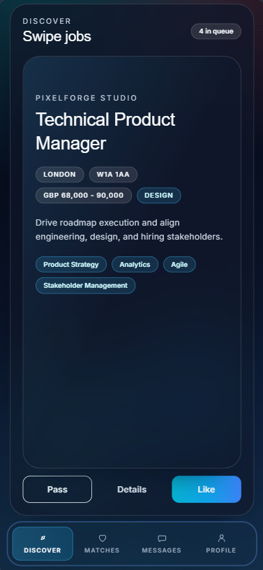
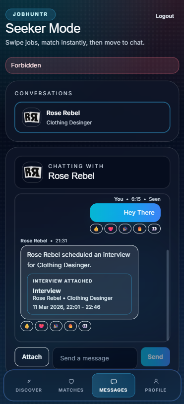
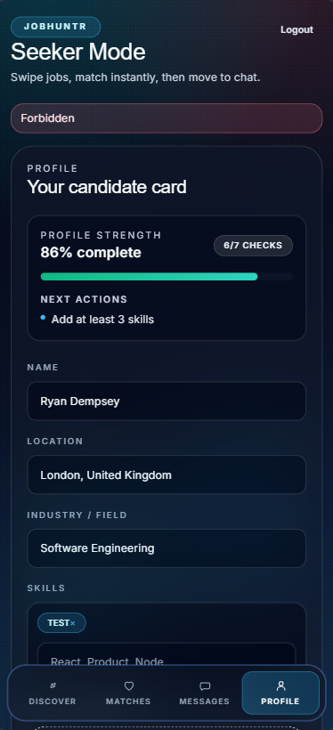

# JobHuntr

JobHuntr is a swipe-first hiring platform inspired by Tinder-style interactions.

- Seekers swipe through jobs
- Companies swipe through candidates
- Mutual right swipes create matches and unlock chat

## App Previews

| Discover | Matches | Messages |
| --- | --- | --- |
|  |  |  |

## Product Highlights

### Core Flow
- Swipe-first discovery for both seekers and companies
- Two-sided matching logic with role-aware behavior
- Real-time messaging for matched users using Socket.io

### UI and UX
- Modern dark theme with mobile-first layout
- Bottom navigation and tabbed sections (Discover, Matches, Messages, Profile)
- Card-based interaction model with animated swipe gestures
- Reusable design system components for consistency (buttons, cards, tabs, inputs, modal sheets)

### Profile and Hiring Features
- Seeker profile picture upload
- Company logo upload
- CV upload, view, and download support
- Skills as tag input
- Location autocomplete
- Industry/Field profile metadata
- Company job CRUD with required industry and postcode
- Postcode radius and industry filters for seeker discovery
- Admin moderation dashboard with company verification and job controls
- Verified company badge for trusted employers in seeker-facing views
- Reports and appeals workflow (jobs, companies, messages)
- Message safety automation with scam signal detection and temporary chat restrictions
- Job quality moderation with pending review and duplicate detection safeguards

## Tech Stack

### Frontend
- React 18 + Vite
- TailwindCSS
- React Router
- Framer Motion
- Axios
- Socket.io client

### Backend
- Node.js + Express
- MongoDB + Mongoose
- JWT auth + bcryptjs
- Socket.io
- Multer (multipart uploads)

## Project Structure

```
JobHuntr/
   client/
      src/
         api/
         components/
         context/
         data/
         pages/
         utils/
   server/
      src/
         config/
         controllers/
         middleware/
         models/
         routes/
         utils/
      uploads/
```

## Prerequisites

- Node.js 18+
- MongoDB running locally (default: mongodb://127.0.0.1:27017)

## Quick Start

### 1) Backend

1. Open a terminal in server
2. Install dependencies

    ```bash
    npm install
    ```

3. Create server/.env from server/.env.example
4. Start the API server

    ```bash
    npm run dev
    ```

### 2) Frontend

1. Open a second terminal in client
2. Install dependencies

    ```bash
    npm install
    ```

3. Create client/.env from client/.env.example
4. Start the frontend app

    ```bash
    npm run dev
    ```

### Default Local URLs

- Frontend: http://localhost:5173
- Backend API: http://localhost:5000
- Health check: http://localhost:5000/api/health

## Environment Variables

### server/.env

| Variable | Required | Example | Notes |
| --- | --- | --- | --- |
| PORT | Yes | 5000 | Express server port |
| MONGO_URI | Yes | mongodb://127.0.0.1:27017/jobhuntr | MongoDB connection string |
| JWT_SECRET | Yes | replace_with_a_strong_secret | JWT signing secret |
| CLIENT_URL | Yes | http://localhost:5173 | CORS allowlist origin |

### client/.env

| Variable | Required | Example | Notes |
| --- | --- | --- | --- |
| VITE_API_URL | Yes | http://localhost:5000/api | REST API base URL |
| VITE_SOCKET_URL | Yes | http://localhost:5000 | Socket.io server base URL |

## Scripts

### server
- npm run dev: Start backend with nodemon
- npm start: Start backend with node
- npm run seed:demo: Seed demo companies, seekers, jobs, and matches
- npm run admin:create: Create or update an admin account using ADMIN_EMAIL and ADMIN_PASSWORD

### client
- npm run dev: Start Vite dev server
- npm run build: Build production bundle
- npm run preview: Preview production build

## API Overview

Base path: /api

- Auth
   - POST /auth/register
   - POST /auth/login
   - GET /auth/me
- Profile
   - GET /profile/me
   - PUT /profile/me
   - GET /profile/candidates
- Jobs
   - GET /jobs
   - GET /jobs/company
   - GET /jobs/:id
   - POST /jobs
   - PUT /jobs/:id
   - DELETE /jobs/:id
- Swipes
   - POST /swipes/job/:jobId
   - POST /swipes/candidate/:candidateId
- Matches
   - GET /matches
   - GET /matches/:matchId/candidate-profile
   - GET /matches/:matchId/interviews
   - POST /matches/:matchId/interviews (company only)
   - PATCH /matches/:matchId/interviews/:interviewId (company only)
- Messages
   - GET /messages/:matchId
   - POST /messages/:matchId
- Notifications
   - GET /notifications
   - PATCH /notifications/:notificationId/read
   - PATCH /notifications/read-all
- Reports
   - POST /reports
   - GET /reports/me
- Appeals
   - POST /appeals
   - POST /appeals/me
- Admin (admin role only)
   - GET /admin/overview
   - GET /admin/companies
   - PATCH /admin/companies/:companyId/verification
   - PATCH /admin/users/:userId/suspension
   - GET /admin/jobs
   - PATCH /admin/jobs/:jobId/status
   - PATCH /admin/jobs/:jobId/moderation
   - GET /admin/reports
   - PATCH /admin/reports/:reportId
   - GET /admin/appeals
   - PATCH /admin/appeals/:appealId
   - GET /admin/messages/flagged
   - PATCH /admin/messages/:messageId/moderation
   - GET /admin/audit-logs

See API_EXAMPLES.md for request examples.

## Uploads

- Uploaded assets are stored in server/uploads and served from /uploads
- Typical assets include profile pictures, company logos, and CV files

## Troubleshooting

- Backend does not start
   - Verify MongoDB is running
   - Verify MONGO_URI in server/.env
- Registration/login issues
   - Verify CLIENT_URL in server/.env matches frontend origin
   - Ensure frontend env points to the correct backend URL
- Empty discovery results
   - Ensure company jobs include postcode and industry
   - Try broadening radius/industry filters

## Demo Seed Data

Run the seed script from the server directory:

```bash
npm run seed:demo
```

This creates:
- 1 demo admin account
- 4 demo company accounts
- 3 demo seeker accounts
- 12 demo jobs (3 per company)
- demo matches and swipe records for interview scheduling tests

Admins are provisioned by seed/script and cannot be created through the public signup flow.

### Demo Admin Credentials

- Demo Admin: `admin@demo.jobhuntr.local`
- Password: `DemoAdmin123!`

### Demo Company Credentials

All demo companies use the same password: `DemoCompany123!`

- Northstar Labs: `northstar.talent@demo.jobhuntr.local`
- PixelForge Studio: `pixelforge.hiring@demo.jobhuntr.local`
- Harbor AI: `harborai.recruit@demo.jobhuntr.local`
- Velocity Health: `velocityhealth.careers@demo.jobhuntr.local`
