# JobHuntr

JobHuntr is a swipe-first hiring platform where:

- Seekers swipe through jobs
- Companies swipe through candidates
- Mutual right swipes create matches and unlock real-time chat

## Screenshot Gallery

### Public Pages

| Landing | Login | Sign Up |
| --- | --- | --- |
|  | 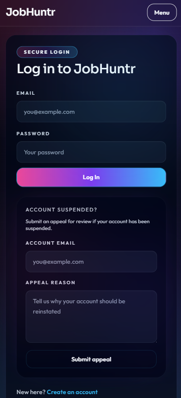 | 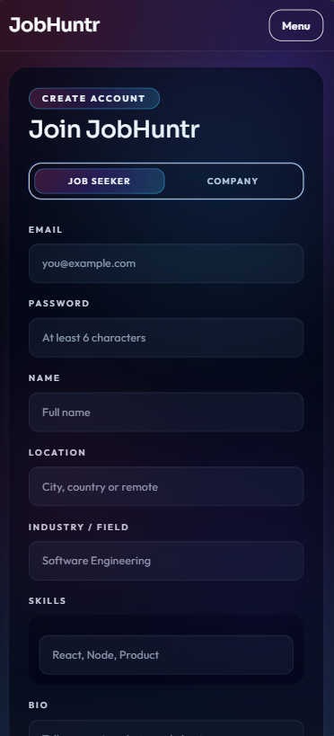 |

### Seeker Dashboard

| Discover | Saved | Matches | Messages | Profile |
| --- | --- | --- | --- | --- |
|  | 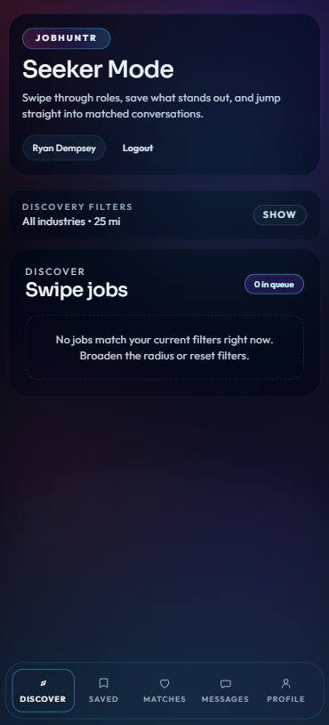 | 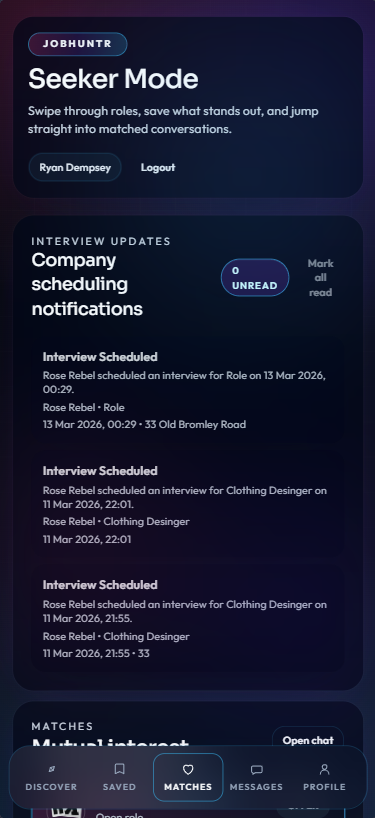 | 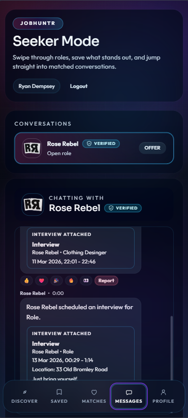 | 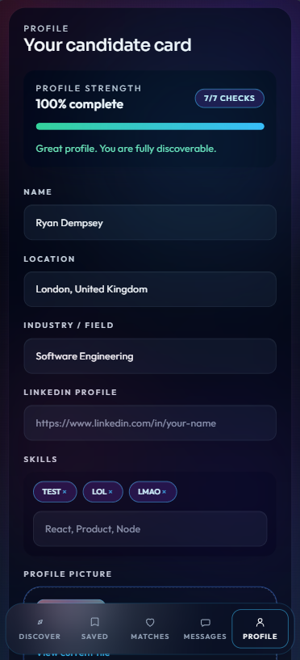 |

### Company Dashboard

| Discover | Jobs | Saved |
| --- | --- | --- |
| 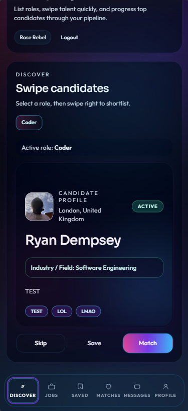 | 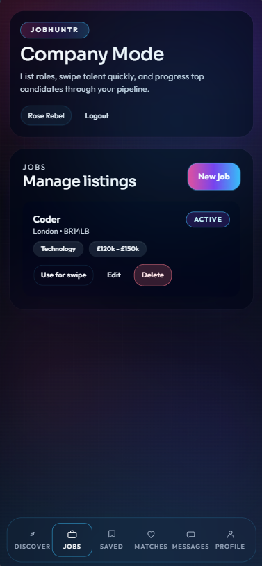 | 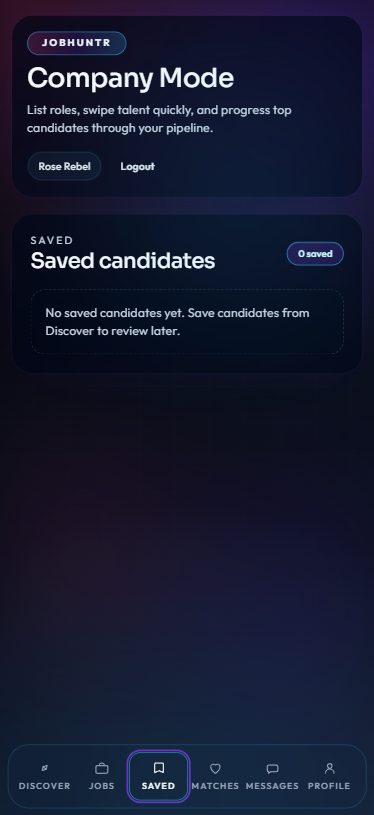 |

| Matches | Messages | Profile |
| --- | --- | --- |
| 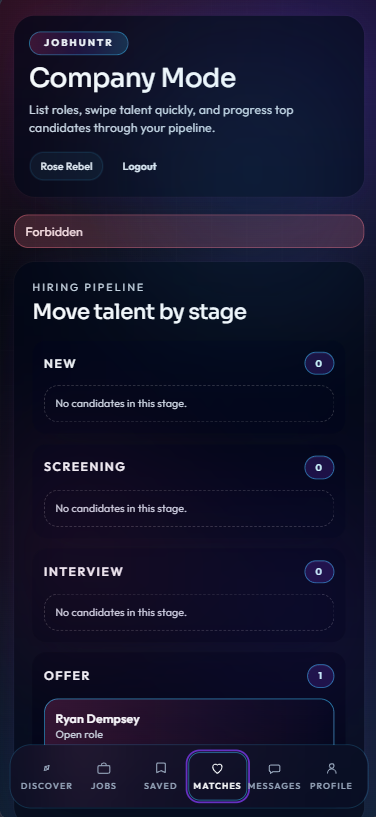 | 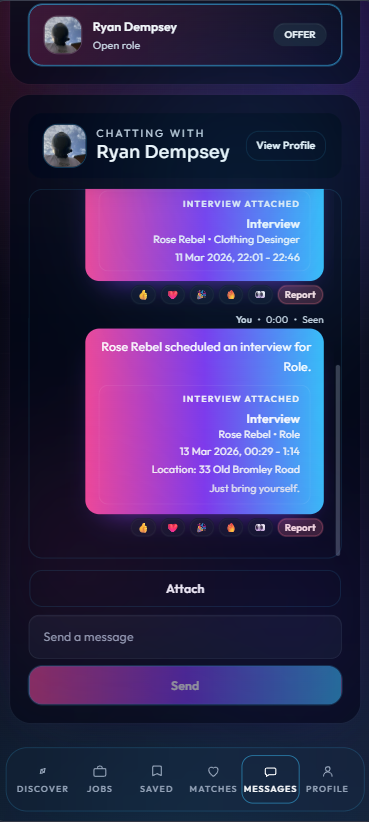 | 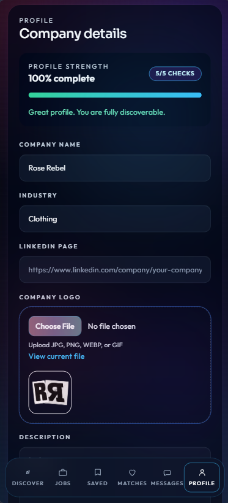 |

## Product Highlights

### Core Experience

- Swipe-first discovery for seekers and companies
- Two-sided matching logic with role-aware behavior
- Real-time chat with read receipts, reactions, and attachments
- Saved jobs/candidates workflow

### Account Security and Trust

- Forgot-password and reset-password token flows
- Email verification request and confirmation
- Change password while authenticated
- Optional two-factor authentication for login
- Moderation notifications for suspensions, appeal outcomes, and message actions

### Hiring Workflow

- Interview scheduling with timezone/location/notes
- Interview responses by both sides: accept, decline, reschedule
- Offer lifecycle: create, update, withdraw, accept/decline
- Offer-level audit trail embedded per match
- Pipeline stage tracking (new, screening, interview, offer)

### Company Team Collaboration

- Invite-based team onboarding
- Company roles: owner, recruiter, viewer
- Role-based write permissions across jobs, interviews, offers, and profile management
- Shared company participant context for matches/messages/realtime rooms

### Notifications, Support, and Moderation

- Notification center with per-event channel preferences (in-app/email/push)
- AI support assistant + ticket escalation to admins
- Admin support queue with replies and status updates
- Reports and appeals workflow
- Admin control center for trust and safety operations

## Tech Stack

### Frontend

- React 18 + Vite
- TailwindCSS
- React Router
- Framer Motion
- Axios
- Socket.io client

### Backend

- Node.js + Express
- MongoDB + Mongoose
- JWT auth + bcryptjs
- Socket.io
- Multer (multipart uploads)

### Public Read-Only API Service

- Separate Express service under `public-api/`
- Read-only endpoints for public jobs, companies, and stats

## Monorepo Structure

```text
JobHuntr/
  client/
    src/
      api/
      components/
      context/
      data/
      pages/
      utils/
  server/
    src/
      config/
      controllers/
      middleware/
      models/
      routes/
      scripts/
      utils/
  public-api/
    src/
  img/
```

## Prerequisites

- Node.js 18+
- MongoDB running locally (default: `mongodb://127.0.0.1:27017`)

## Quick Start

### 1) Backend API (`server`)

```bash
cd server
npm install
cp .env.example .env
npm run dev
```

### 2) Frontend App (`client`)

```bash
cd client
npm install
cp .env.example .env
npm run dev
```

### 3) Optional Public API (`public-api`)

```bash
cd public-api
npm install
cp .env.example .env
npm run dev
```

### Local URLs

- Frontend: `http://localhost:5173`
- Backend API: `http://localhost:5000`
- Backend health: `http://localhost:5000/api/health`
- Public API base: `http://localhost:5100/api/public`

## Environment Variables

### `server/.env`

| Variable | Required | Example | Notes |
| --- | --- | --- | --- |
| PORT | Yes | 5000 | Express server port |
| MONGO_URI | Yes | mongodb://127.0.0.1:27017/jobhuntr | MongoDB connection string |
| JWT_SECRET | Yes | replace_with_a_strong_secret | JWT signing secret |
| CLIENT_URL | Yes | http://localhost:5173 | CORS allowlist origin |

### `client/.env`

| Variable | Required | Example | Notes |
| --- | --- | --- | --- |
| VITE_API_URL | Yes | http://localhost:5000/api | REST API base URL |
| VITE_SOCKET_URL | Yes | http://localhost:5000 | Socket.io server base URL |

### `public-api/.env`

See `public-api/README.md` for full config details (including API-key and rate-limit options).

## Scripts

### `server`

- `npm run dev`: start backend with nodemon
- `npm start`: start backend with node
- `npm run seed:demo`: seed demo users/jobs/matches
- `npm run admin:create`: create/update admin user

### `client`

- `npm run dev`: start Vite dev server
- `npm run build`: build production bundle
- `npm run preview`: preview production build

### `public-api`

- `npm run dev`: start public API with nodemon
- `npm start`: start public API with node
- `npm run check`: run node syntax check for `src/server.js`

## API Overview

Base path: `/api`

### Auth

- `POST /auth/register`
- `POST /auth/login`
- `POST /auth/login/2fa`
- `POST /auth/forgot-password`
- `POST /auth/reset-password`
- `POST /auth/verify-email`
- `GET /auth/me`
- `POST /auth/change-password`
- `POST /auth/verify-email/request`
- `POST /auth/2fa/request`
- `POST /auth/2fa/enable`
- `POST /auth/2fa/disable`

### Profile

- `GET /profile/me`
- `PUT /profile/me`
- `GET /profile/candidates`

### Jobs

- `GET /jobs`
- `GET /jobs/company`
- `GET /jobs/:id`
- `POST /jobs`
- `PUT /jobs/:id`
- `DELETE /jobs/:id`

### Swipes

- `POST /swipes/job/:jobId`
- `POST /swipes/candidate/:candidateId`

### Matches and Interviews

- `GET /matches`
- `GET /matches/:matchId/candidate-profile`
- `PATCH /matches/:matchId/stage`
- `GET /matches/:matchId/interviews`
- `POST /matches/:matchId/interviews`
- `PATCH /matches/:matchId/interviews/:interviewId`
- `POST /matches/:matchId/interviews/:interviewId/respond`

### Offers

- `GET /matches/:matchId/offers`
- `POST /matches/:matchId/offers`
- `PATCH /matches/:matchId/offers/:offerId`
- `PATCH /matches/:matchId/offers/:offerId/respond`

### Messages

- `GET /messages/:matchId`
- `POST /messages/:matchId`
- `POST /messages/:matchId/read`
- `POST /messages/:messageId/reactions`

### Notifications

- `GET /notifications`
- `GET /notifications/preferences`
- `PUT /notifications/preferences`
- `PATCH /notifications/read-all`
- `PATCH /notifications/:notificationId/read`

### Saved Items

- `GET /saved`
- `POST /saved/job/:jobId`
- `POST /saved/candidate/:candidateId`
- `DELETE /saved/:savedItemId`

### Reports and Appeals

- `POST /reports`
- `GET /reports/me`
- `POST /appeals`
- `POST /appeals/me`

### Support

- `POST /support/chatbot`
- `GET /support/tickets`
- `POST /support/tickets`
- `GET /support/tickets/:ticketId`
- `POST /support/tickets/:ticketId/messages`
- `GET /support/admin/tickets`
- `GET /support/admin/tickets/:ticketId`
- `POST /support/admin/tickets/:ticketId/reply`
- `PATCH /support/admin/tickets/:ticketId/status`

### Company Team

- `POST /company-team/invites/accept`
- `GET /company-team/members`
- `GET /company-team/invites`
- `POST /company-team/invites`
- `PATCH /company-team/invites/:inviteId/revoke`
- `PATCH /company-team/members/:memberId/role`
- `DELETE /company-team/members/:memberId`

### Admin (admin role)

- `GET /admin/overview`
- `GET /admin/companies`
- `PATCH /admin/companies/:companyId/verification`
- `PATCH /admin/users/:userId/suspension`
- `GET /admin/jobs`
- `PATCH /admin/jobs/:jobId/status`
- `PATCH /admin/jobs/:jobId/moderation`
- `GET /admin/reports`
- `PATCH /admin/reports/:reportId`
- `GET /admin/appeals`
- `PATCH /admin/appeals/:appealId`
- `GET /admin/messages/flagged`
- `PATCH /admin/messages/:messageId/moderation`
- `GET /admin/audit-logs`

See `API_EXAMPLES.md` for request/response examples.

## Uploads

- Uploaded assets are stored in `server/uploads`
- Uploaded files are served from `/uploads`
- Typical assets: profile images, company logos, CV/resume files

## Troubleshooting

- Backend does not start
  - Verify MongoDB is running
  - Verify `MONGO_URI` in `server/.env`
- Login, reset, or verify-email issues
  - Verify `CLIENT_URL` in `server/.env`
  - Verify `VITE_API_URL` and `VITE_SOCKET_URL` in `client/.env`
- Empty discovery queues
  - Ensure company jobs include postcode and industry
  - Broaden radius and industry filters

## Demo Seed Data

Run from the `server` directory:

```bash
npm run seed:demo
```

This seeds:

- 1 demo admin account
- 4 demo company accounts
- 3 demo seeker accounts
- 12 demo jobs (3 per company)
- sample swipes, matches, and interview test data

Admins are created by seed/scripts and are not available through public sign up.

### Demo Admin

- Email: `admin@demo.jobhuntr.local`
- Password: `DemoAdmin123!`

### Demo Companies

All demo companies use password: `DemoCompany123!`

- Northstar Labs: `northstar.talent@demo.jobhuntr.local`
- PixelForge Studio: `pixelforge.hiring@demo.jobhuntr.local`
- Harbor AI: `harborai.recruit@demo.jobhuntr.local`
- Velocity Health: `velocityhealth.careers@demo.jobhuntr.local`
